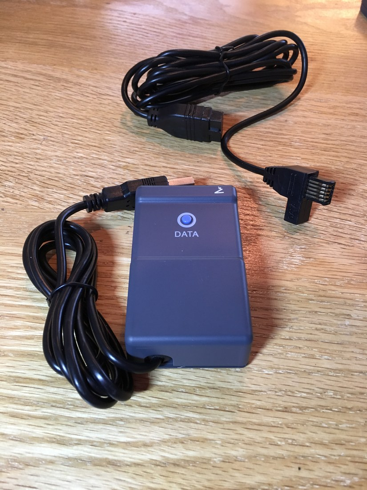
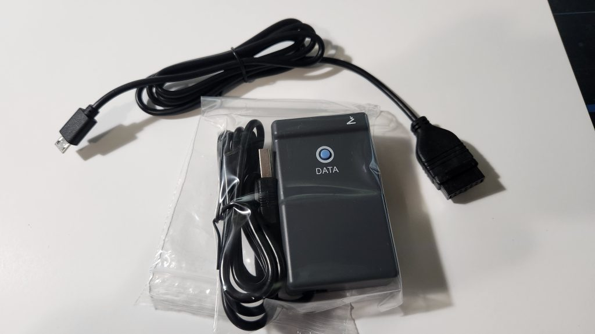
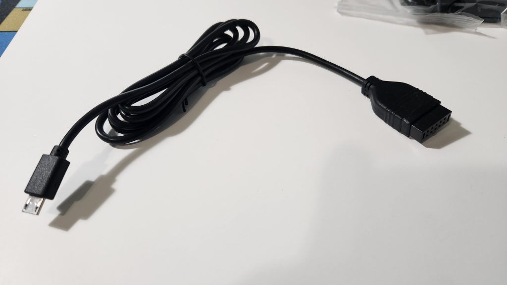
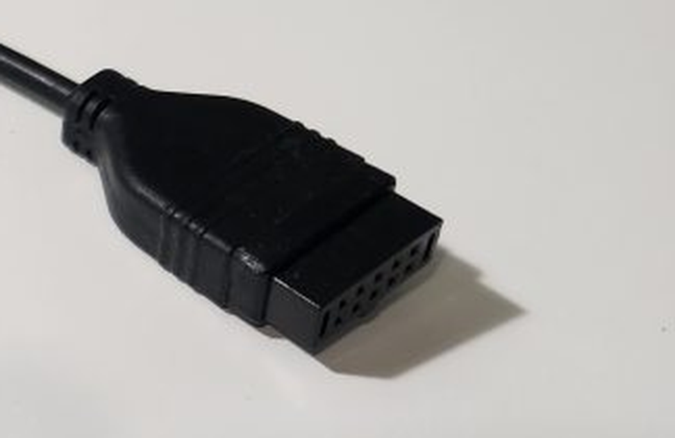

# The iGaging DataConnect Kit: Supply Chain and Hardware Architecture

**What this is:** a standalone write-up of a single line of investigation — *who actually makes the
iGaging data-output hardware, and what its physical design reveals about the wire protocol on the
35-065-U01's micro-USB port.*

**Why it exists:** iGaging's refusal to document the protocol ("it is a 3rd party item, so we r not be
able to share information") is usually read as stonewalling. Taken literally, it is a research lead —
it says there is an outside supplier with a spec. Following that lead produced better evidence than
any amount of protocol searching had.

**Date:** 2026-07-26
**Companion document:** `igaging_protcol_research.md` — full protocol specs, decode code, bench
procedure. This document supersedes that document's original hypothesis ranking; see §6.


> ## ⚠ PROVENANCE — unsubstantiated third-party inference, NOT bench data
>
> Everything in this document is **desk research**: vendor product photography, third-party
> standards documentation, and inference chains built on top of them. **Nothing here was measured,
> and none of it touched this micrometer.** The author's own §7 says so — *"No one has published a
> capture from a 35-065 specifically. This remains inference, not measurement."*
>
> **It was also written with no knowledge of this project.** It is isolated research: it has never
> seen `BENCH_LOG.md` and knows none of our measurements — not that pin 1 is the mic's only observed
> output, not that pins 4 and 5 are both ground, not that pin 1 draws 0 mA, not the DATA-button
> trigger condition. So its §7 "the ranking is now inverted" is an update *within its own desk
> research*, not one that weighs our bench data. Read it that way.
>
> Specific things that are **assumed, not established**:
> - that the two kits' control boxes are electrically identical (they look alike in photos);
> - that the 2×5 connector in those photos is the Mitutoyo Digimatic 10-pin standard;
> - that the micro-USB adapter cable is passive rather than containing a converter (§5.1 concedes
>   this and proposes §6 to settle it);
> - the button-count argument in §5.2, which reads a protocol off a photograph of a housing.
>
> **Where this conflicts with `BENCH_LOG.md`, the bench log wins.** Treat this as a well-argued
> hypothesis that generates one excellent cheap experiment (§6, ohm out the adapter cable) — not as
> a finding. See `review.md` §11 for the assessment and for which of our conclusions it does and
> does not move.

---

## 1. iGaging does not manufacture anything

**iGaging is a brand of International Precision Instrument Corporation (IPIC)**, San Clemente,
California. IPIC is an importer and brander of precision measuring tools, not a factory. Their own
marketing leans on domestic oversight and QC rather than on manufacturing.

So the support reply is literal and probably honest: IPIC buys the DataConnect kits from an outside
supplier and may not possess the interface spec at all.

**Consequence for research:** stop looking for an iGaging document. Look for the **OEM's** document —
or, failing that, read the OEM's design decisions off the hardware.

---

## 2. The decisive observation: two kits, one box

iGaging sells two wired data-output kits. Put their product photography side by side.

### 100-700-USB — the "SPC" kit



* Control box: a wedge-shaped housing with **one** round blue button marked `DATA`.
* A **captive** cable from the box terminating in a **USB-A plug** for the PC.
* A **detachable** instrument cable: **flat Mitutoyo-style SPC plug** at the tool end, **2×5 (10-pin)
  female socket** at the box end.

### 100-700-USB-MC — the "Micro" kit



* **The identical control box.** Same wedge housing, same single blue `DATA` button, same captive USB-A
  lead.
* A different detachable instrument cable: **micro-USB plug** at the tool end…



* …and **the same 2×5 10-pin female socket** at the box end.



Two rows of five sockets, polarising keyway along the top edge, plain overmoulded strain relief.

### The architecture

```
   instrument                adapter cable                    control box            PC
 ┌────────────┐   ┌──────────────────────────────┐   ┌────────────────────┐
 │ 35-065-U01 ├───┤ micro-USB  ⟷  2×5 10-pin     ├───┤ Digimatic wedge    ├── USB-A ──▶ HID keyboard
 └────────────┘   └──────────────────────────────┘   │ (one DATA button)  │
                  ┌──────────────────────────────┐   └────────────────────┘
 SPC-port tools ──┤ flat SPC   ⟷  2×5 10-pin     ├──────────▲
                  └──────────────────────────────┘
```

One box. Two interchangeable adapter cables. The connector form factor at the *tool* end is the only
thing that varies.

---

## 3. The 2×5 connector is the Mitutoyo Digimatic standard

This is not a generic IDC header that happens to have ten pins. It is *the* Digimatic interface
connector:

* It is the connector on the processor end of Mitutoyo's own cables **936937** and **05CZA662**.
* It is the input on Mitutoyo **DP-1VR** mini-processors, **MUX-10** multiplexers, and
  **IT-012U / IT-016U / USB-ITN** input tools.
* Third-party gage-interface vendors specify it by that exact name: MicroRidge's **GageWay KW**
  keyboard wedge lists its input as "Mitutoyo Digimatic 10-pin (Type D Male)"; ASDQMS sells a
  "Mitutoyo Gages with 10-pin Plain Connector SmartCable".

### Confirmed pinout

From Tomer Lanzman's Caliper2PC *Connecting Mitutoyo Digimatic Devices* guide:

| Pin | Signal |
|---|---|
| 1 | GND |
| 2 | DATA |
| 3 | CLOCK |
| 4 | RDY (present on some tools; often unused) |
| 5 | REQ |
| 6–10 | Not connected |

**Therefore: the iGaging control box is a generic Mitutoyo-Digimatic keyboard wedge** — functionally
equivalent to a MicroRidge GageWay KW or an ASDQMS SmartCable — with a standard Digimatic input.

---

## 4. Is it rebranded Mitutoyo?

**No — almost certainly not Mitutoyo-manufactured.** Mitutoyo's own USB Input Tools (IT-016U, USB-ITN,
264-020) are differently shaped, differently branded, and sell for several times the iGaging price.

**But it is built to Mitutoyo's standard**, which is the more useful finding. Digimatic is the RS-232
of shop metrology: Mitutoyo defined it, and Fowler, Insize, Mahr, CDI, Starrett and the Chinese houses
all emit compatible frames precisely so that off-the-shelf wedges, multiplexers and SPC software work
with their tools. Building to Digimatic is the default commercial decision, not an unusual one.

**Most likely actual OEM:** a Chinese SPC-accessory house selling the same box to many brands.
**I was not able to identify it by name.** No Alibaba / Made-in-China listing or teardown surfaced
matching this housing. See §7 — this is the most promising unfinished thread, because an OEM datasheet
would very likely state the wire protocol outright.

---

## 5. What this implies about the micrometer's protocol

Two independent arguments, both pointing the same way.

### 5.1 The box can only understand one thing

If the micro-USB adapter cable is **passive** — just a pin remap — then the 35-065 must be emitting
**Mitutoyo Digimatic** on its micro-USB pins, because Digimatic is all the box can decode.

**The counter-case:** the cable could hide a converter. This is exactly how ASDQMS "SmartCable"
products work, with a microcontroller potted into the connector hood. From the photos, the micro-USB
cable's 2×5 hood looks like ordinary strain-relief overmoulding with no potting bulge, and it is no
bulkier than the SPC cable's hood. Suggestive, not conclusive. §6 resolves it.

### 5.2 The button count

**The box has exactly one button: `DATA`.**

A Digimatic frame is self-describing — 13 nibbles carrying sign, six digits, decimal-point position and
units. A wedge receiving one needs a single "send it now" button and nothing else.

A tool emitting **raw encoder counts** cannot work that way. Raw counts have no zero reference and no
units, so the interface would have to carry **zero** and **units** buttons and track that state itself.

The 35-065's official interface has neither. That is a strong argument that the tool is sending a
display-ready value, i.e. Digimatic.

---

## 6. The experiment this unlocks

**Ohm out the 100-700-USB-MC adapter cable.** Ten minutes, a multimeter, no power applied, nothing
opened, nothing at risk.

One end is micro-USB (5 pins). The other is a Digimatic 2×5 whose pinout is now known (§3). Buzz every
micro-USB pin against every 2×5 pin.

| Result | Meaning |
|---|---|
| **Five clean 1:1 connections** | The cable is passive ⇒ the tool speaks **Digimatic** ⇒ and you have recovered the **entire micro-USB pinout for free**, including which pin is REQ |
| **Opens, diode drops, or unexpected resistance** | Active electronics in the hood ⇒ the §5.1 inference chain breaks ⇒ fall back to probing the instrument port directly |

This single measurement discriminates between the two leading protocol hypotheses more cheaply and
more safely than any amount of logic-analyzer work, which is why it is now **step 0** of the bench
procedure in the companion document.

**Second-best experiment if you own the kit:** put a micro-USB breakout **in-line** between micrometer
and control box and capture passively. You get real clock timing, real frame length, and — because the
box is a USB HID keyboard — you can correlate raw frames against the exact decimal string it types.

---

## 7. What changed in the conclusions

The companion document originally ranked the **iGaging 21-bit** protocol above **Digimatic** for this
tool. That ranking is now **inverted**.

### The error

The original argument was: *"keyboard-emulating Digimatic boxes don't need zero/units buttons, yet the
official micro-USB box has them — consistent with a raw-count tool."*

The premise was false. The three-button description came from Alex Whittemore's blog post and was
carried over to the 35-065 without verification. **The 35-065's actual accessory, the 100-700-USB-MC,
has one button.** The same reasoning, applied to the correct hardware, argues the opposite way (§5.2).

### The reconciliation

Alex Whittemore's 21-bit finding is *not* wrong. He opened his micrometer's case, found the PCB pinned
out with `VDD` / `SSY` / `DATA` test points — the 21-bit signature — loaded Rysiu M's Arduino sketch,
and read real data that tracked spindle movement linearly. That is solid empirical work.

**His micrometer is probably just a different model.** Two tells:

1. He states the official cable for his mic has **three buttons: zero, units, and read out**. The
   35-065's has one. Different accessory ⇒ different tool family.
2. He describes it as "$40 shipped" and in iGaging's "cheaper product range." The 35-065 iP65
   Twin-Force is a premium line at several times that.

**The coherent reading: iGaging uses both protocols across its range.** Cheap micrometers emit raw
21-bit encoder counts and need a three-button smart cable. The premium Absolute / EZ-Data line
(35-065, 35-A67) emits Digimatic and needs only a one-button wedge.

### Standing caveats

* No one has published a capture from a 35-065 specifically. This remains inference, not measurement.
* The adapter-cable-is-passive assumption is unverified (§6 verifies it).
* The two strongest "iGaging = Digimatic" citations are **not independent** — the Instructables author
  (`sspence`) and the Hobby-Machinist poster are the same person, Steve Spence. And both concern
  iGaging's *flat-SPC-connector* tools, not the micro-USB port.

---

## 8. Unfinished business on the OEM angle

Ranked by expected value:

1. **Identify the control box's OEM.** Reverse image search the housing (distinctive wedge shape,
   single round blue button); search Alibaba / Made-in-China / 1688 for "SPC data cable USB keyboard
   Digimatic". An OEM datasheet would very likely state the wire protocol outright — this is the single
   highest-value remaining lead.
2. **Look for the same box under other brands** — Accusize, Dasqua, Shahe, Clockwise Tools, Anytime
   Tools, VINCA, Insize. A brand with better documentation may publish what iGaging won't.
3. **Ask MicroRidge or ASDQMS** whether their Digimatic wedges work with an iGaging 35-065 through a
   micro-USB adapter. They maintain large gage-compatibility matrices and answer technical email. A
   "yes" is strong independent confirmation.
4. **Open the control box.** The MCU part number and the input-side circuitry would show what it
   expects — a bare Digimatic wedge will have pull-ups and an open-drain REQ driver.
5. **Ask IPIC for the supplier's name, not the spec.** They declined to share the spec because it isn't
   theirs. They may be willing to say whose it is.
6. **Identify Alex Whittemore's micrometer** by finding the three-button cable's part number. That
   would confirm or kill the two-protocol-families theory in §7.

---

## 9. Sources

**Supply chain / brand**
- [iGaging Tools brand site — IPIC, San Clemente CA](https://igagingtools.com/)
- [iGaging — DataConnect Data Output Kits](https://www.igaging.com/dataout-kits.html) — the catalogue page describing both kits and the "SPC data port" framing
- [Hobby-Machinist — "Igaging Origin Data Spec"](https://www.hobby-machinist.com/threads/igaging-origin-data-spec.38482/) — source of the "3rd party item" quote

**The photographs**
- [ideaengineering.us — 100-700-USB-MC micro USB data cable & control box](https://ideaengineering.us/store-3/pageid1904modelnumber100-700-usb-mc/)
- [ideaengineering.us — 100-700-USB SPC/USB data cable & control box](https://ideaengineering.us/store-3/pageid1904modelnumber100-700-usb/)

Local copies of the four images used above are in `igaging_images/`.

**The Digimatic 10-pin standard**
- [Caliper2PC — Connecting Mitutoyo Digimatic Devices (PDF)](https://www.caliper2pc.de/download/mitutoyo.php) — confirmed pinout: 1=GND, 2=DATA, 3=CLOCK, 5=REQ
- [MicroRidge — Mitutoyo 936937 2×5 Digimatic 10-pin cable](https://www.microridge.com/shop/mini-mobile-module-cables/mitutoyo-2x5-connector-cable/)
- [MicroRidge — GageWay KW keyboard wedge](https://www.microridge.com/shop/single-gage-interface/gageway-kw-with-keyboard-output/)
- [ASDQMS — Mitutoyo 10-pin plain connector SmartCable with keyboard output](https://www.spcanywhere.com/mitutoyo-gages-with-10-pin-plain-connector-smartcable-with-keyboard-output/)
- [Mitutoyo — USB Input Tool press release (IT-016U / USB-ITN)](https://www.mitutoyo.com/press_releases/new-mitutoyo-usb-input-tool/)

**Protocol evidence referenced in §7**
- [Reading an iGaging Micrometer's Digital Output — alexwhittemore.com](https://www.alexwhittemore.com/reading-an-igaging-micrometers-digital-output/)
- [TouchDRO — iGaging AbsoluteDRO Plus Scales](https://www.touchdro.com/resources/scales/capacitive/igaging-absolute-dro) — "use the Mitutoyo SPC (Digimatic) protocol verbatim"
- [Instructables — Interfacing a Digital Micrometer to an Arduino & VGA Monitor (sspence)](https://www.instructables.com/Interfacing-a-Digital-Micrometer-to-a-Microcontrol/)
