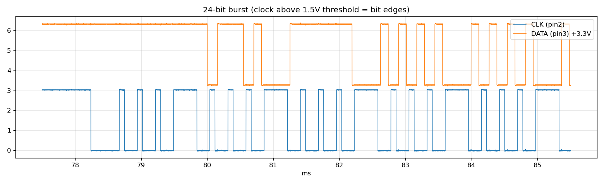
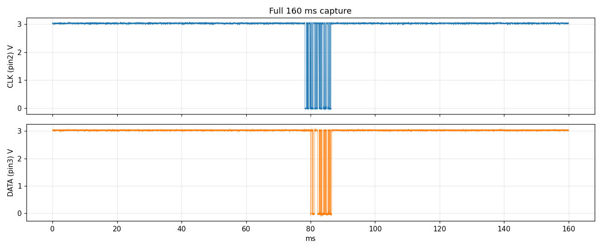

# Mxmoonfree LS-20 Digital Caliper — "Mini/Micro USB" Data Port Reverse-Engineering Guide

A working reference for confirming the pinout and building a hardware/software interface
to log measurements from the Mxmoonfree LS-20 digital caliper.

| Field | Value |
|---|---|
| Tool | Mxmoonfree 20" / 500 mm long-jaw digital caliper |
| Model / part | LS-20 / LS-20-6 |
| UPC | 735279171235 |
| Listing | https://www.amazon.com/dp/B0925RVN51 |
| Seller contact | mxmoonfree2021@outlook.com |
| Battery | CR2032 (3 V coin cell) |
| Resolution | 0.0005" / 0.01 mm |
| "Data output" connector | Micro/Mini-USB receptacle (physical only — **not** USB) |

---

## 0. TL;DR — read this first

> **STATUS: fully reverse-engineered as of 2026-06-21 — see [§0.5 RESULTS](#05-results--protocol-fully-decoded-2026-06-21-) for the
> authoritative pinout, signal parameters, and decode. Sections 1–9 below are the original
> pre-measurement guide; where they disagree with §0.5, §0.5 wins (correction notes added inline).**

- The "data output interface" is a **proprietary low-voltage synchronous serial port** (clock +
  data + Vdd + ground) that merely *reuses a Micro-USB connector* as a cheap physical jack. It does
  **not** speak USB.
- **Do not plug this port into any USB host again** (PC, charger, hub, or the Pi). The pin that a USB
  host drives as +5 V VBUS lands on the caliper's internal low-voltage (~3 V) serial/power circuitry.
  That is what caused the Pi 5's `over-current change` event and the bus disconnect: the Pi's USB power
  controller tripped its over-current protection to defend itself. Repeating it risks damaging the
  caliper's measurement ASIC and/or the Pi's USB power path.
- ~~The signals are well below logic level (~1.5 V) and need a level shifter.~~ **CORRECTED (§0.5):** the
  signals swing the **full ~3 V** rail (idle high), comfortably above a 3.3 V MCU's input threshold, so
  **no level shifter is needed.**
- You do **not** need to open the caliper. Everything is exposed on the connector pins; access them
  with a **Micro-USB *male* breakout board** used as a passive mechanical fan-out.

---

## 0.5 RESULTS — protocol fully decoded (2026-06-21) ✅

Confirmed end-to-end against the LCD at 5 known readings (0.00 mm, 10.00 mm, 100.00 mm,
−20.00 mm, 0.9840 in). Captures + decode tooling live in this directory.

**Electrical (all referenced to Pin 5 = GND = battery −):**
- Pin1 = V+ ≈ 3.0 V (caliper body / battery +) · Pin2 = CLOCK · Pin3 = DATA · Pin4 = V+ (ID tied high) · Pin5 = GND.
- Logic is **full-rail ~3 V, idle high** → no level shifter needed for a 3.3 V MCU. ⚠️ Never connect Pin1/Pin4 to the MCU.

**Signal:**
- **24-bit frame**, **LSB first**, clock idles high and pulses low, **~274 µs/bit**, burst ~6.6 ms.
- **Read DATA on the clock RISING edge** (data is driven during clock-low and settles ~40 µs before the rising edge).
- New frame every **107.2 ms** (~9.33 Hz), sent continuously even when idle.

**Bit layout (LSB-first index):**

| Bits | Meaning |
|---|---|
| 0–19 | unsigned magnitude integer |
| 20 | sign (1 = negative) |
| 21–22 | unused (always 0 observed) |
| 23 | unit flag (**1 = inch, 0 = mm**) |

**Value:** `mm  = (magnitude / 100) × (sign)`  ·  `inch = (magnitude / 2000) × (sign)`
(mm resolution 0.01 mm; inch resolution 0.0005 in). Reference decoder: `caliper_decode.py`.

**Worked example (−20.00 mm):** frame `000010111110000000001000` → magnitude(b0–19)=2000, bit20=1 → −2000/100 = **−20.00 mm**. ✅

> ⚠️ **Behavioral caveat — the `pre-` / `pre+` preset buttons are DISPLAY-ONLY.** These buttons (per the
> caliper's documentation) add/subtract a preset offset to the **LCD reading only**; the serial data port
> always transmits the **raw measured value** (relative to the active zero/origin), ignoring any preset
> offset. **Consequence:** when a preset offset is active, the transmitted value will NOT match the LCD.
> Any consuming software should treat the data-port value as ground truth and apply preset offsets itself
> if it wants to mirror the display.

**Validation — blind test (2026-06-21):** six positions (A–F) were set and recorded on paper *before*
decoding, including mm, inch, negatives, and near-full-travel values. **A–E decoded to exact matches.**
F was the same physical position as E but with a −0.23 mm `pre-` preset applied: the data port emitted the
identical frame as E (display-only offset confirmed, as above). Net: **6/6 explained, decoder confirmed.**

---

## 1. What the port actually is

Cheap digital calipers with a "data output" feature almost universally emit a proprietary synchronous
serial stream — one clock line, one data line, plus power and ground. A large number of them, including
VINCA-branded units that are the most-documented analog to this one, put that proprietary signal on a
Micro-USB connector purely for cost/availability reasons. There is no USB transceiver inside.

The widely-reported format is a **24-bit synchronous serial frame**, clocked out a couple of times per
second, at a logic level too low (~1.2–1.5 V) to read directly with a 3.3 V part — hence the need for a
level shifter. This is the same pattern across most caliper brands; only the connector and minor
protocol details vary.

References:
- Hackaday — VINCA Reader (USB + Wi-Fi interface, the closest precedent to this caliper):
  https://hackaday.com/2022/10/17/custom-interface-adds-usb-and-wi-fi-to-digital-calipers/
- Hackaday — digital caliper tag (multiple related projects):
  https://hackaday.com/tag/digital-caliper/
- Hackaday — calipers → Raspberry Pi via the serial interface:
  https://hackaday.com/2019/07/04/hacked-calipers-make-automated-measurements-a-breeze/

---

## 2. Why the Pi reported `over-current change`

On a real Micro-USB host connection, the host supplies +5 V on VBUS (pin 1) and expects D+/D-/GND on the
others. On this caliper those physical positions are wired to its own ~3 V serial/power lines (measured;
see §0.5). Plugging into the Pi pushed 5 V into low-voltage circuitry and/or presented a near-short through the caliper
front-end. The Pi's downstream USB power controller saw excess current, tripped over-current protection,
and shut down the bus (that's the repeating `over-current change` log until unplug). Protection most
likely saved both ends — but don't rely on that twice.

---

## 3. The serial protocol (what to expect, then confirm)

> **CONFIRMED (§0.5):** this caliper uses the **"24-bit binary"** variant below — **LSB first, read on the
> clock rising edge** — but with **~274 µs/bit** (not the ~13 µs of the alternate format) and a **107.2 ms**
> packet interval. Exact decoded bit layout: bits 0–19 magnitude, bit 20 sign, bit 23 inch/mm (bits 21–22
> unused). See §0.5 for the authoritative version; the variants below are kept as reference.

There are a few protocol variants in the wild. Treat the following as the **likely** format and confirm
empirically (Section 5).

### Most common modern format ("24-bit binary")
- One 24-bit packet sent roughly every **~100–126 ms**.
- **LSB first**, clocked on the rising edge.
- Bit layout (counting from the last/MSB bit sent backward):
  - inch/mm flag bit (set = inches)
  - sign bit (set = negative)
  - remaining ~21 bits = unsigned integer = **100 × value-in-mm** (or **2000 × value-in-inch**)
- Reference: https://github.com/eadf/esp8266_bitseq/wiki/caliper

### Alternate format ("two 24-bit groups")
- Long start bit, a 23-bit group, a long middle bit, another 23-bit group, long stop bit.
- Example captured timings: start bit ~58.76 µs, each data bit ~**13.02 µs**, ~299 µs per 23-bit group.
- Data changes while clock is **high**; safest to **read on the clock's falling edge**.
- Reference (with logic-analyzer traces): https://www.robotroom.com/Caliper-Digital-Data-Port-2.html

### Other documented variants
- Six 4-bit (BCD-style) nibbles within a 24-bit stream — Yuriy's Toys:
  https://www.yuriystoys.com/2013/07/chinese-caliper-data-format.html
- 48-bit "Chinese Scales" format (Shumatech) — older indicators/scales; search "Shumatech Chinese Scales".
- General protocol + 4-pin description (1.5 V supply / clock / data / ground):
  https://sites.google.com/site/marthalprojects/home/arduino/arduino-reads-digital-caliper
  (links onward to the pcbheaven "Chinese BCD" protocol page)

> **Note:** The clock/data pins are frequently **shared with the front-panel buttons**. Pulling those
> lines low can trigger button functions, so any interface must stay **input-only / high-impedance**
> toward the caliper.

---

## 4. Tooling

On-hand and relevant:
- Digital oscilloscope — **primary discovery tool** (separate clock vs. data, capture levels/timing).
- Bench DMM — find GND and Vdd; rough pin ID.
- ESP32 — capture/decode front-end; optional Wi-Fi/MQTT push.
- Flipper Zero — logic-analyzer app → PulseView, useful for decode/verify **after** level shifting.
- Level shifters, RPi GPIO breakouts.

Need to obtain:
- **Micro-USB *male* breakout board** exposing all 5 contacts to individual pads. (Avoid sacrificed USB
  cables — they typically carry only 4 conductors and omit the ID pin, which the caliper may use.)

---

## 5. Pinout confirmation procedure

> Safety rule for every step: **never apply external power to any pad.** The caliper powers itself from
> its CR2032. The breakout is a passive fan-out only; ignore its USB silkscreen labels.

### Step 1 — Establish ground
- Open the battery door (not "opening the caliper"); confirm battery negative is bonded to the metal beam.
- Caliper **off**, DMM in continuity: find the breakout pad continuous with the frame/beam. **That pad = GND**
  and is the reference for all measurements.

> ⚠️ **RESULT (§0.5): on THIS caliper the battery *POSITIVE* bonds to the beam/body — not the negative.**
> The signal-reference ground is **battery NEGATIVE = Pin 5** (continuous with the battery − contact, NOT
> the beam). Use Pin 5 as the reference; never wire Pin 1/Pin 4 (both = body/V+) to a logic input.

### Step 2 — Find Vdd (DMM)
- Caliper **on** and idle. Black probe on GND. Measure each remaining pad (DC volts).
- The pad sitting at a steady **~1.5 V** is **Vdd** (internal regulated rail; note the cell is 3 V CR2032,
  so confirm the actual rail rather than assuming). **This number drives the level-shifter design.**
- Clock/data pads read jumpy intermediate averages on a DMM; the unused pad likely floats.

> ⚠️ **RESULT (§0.5): Vdd = Pin 1 = +3.029 V (full cell voltage); there is no separate ~1.5 V rail, and
> the data/clock logic swings the full ~3 V — so no level shifter is needed.**

### Step 3 — Separate clock vs. data and capture parameters (scope)
- Scope ground clip on caliper GND; probe each active pad. Single-shot trigger on an edge; **slide the
  jaws** to force a transmission.
- **Clock** = uniform pulse train: a burst of ~24 evenly spaced pulses, repeating ~every 100–126 ms.
- **Data** = pattern within the burst that changes with the reading.
- Record the four parameters that determine the whole build in the table below.

### Step 4 — Identify the format
- Single 24-bit frame vs. two 24-bit groups vs. six-nibble BCD (compare against Section 3).

### Parameters to record

> Micro-USB pin numbering used below: **1 = VBUS, 2 = D-, 3 = D+, 4 = ID, 5 = GND** (standard
> Micro-USB contact order). Ignore the breakout silkscreen; these are the physical contact positions.

| Parameter | Expected (confirm!) | Measured (2026-06-21) |
|---|---|---|
| GND pad (connector position) | continuous w/ frame | **Pin 5** = battery **negative**. ⚠️ NOT the frame — see note. |
| Vdd pad / voltage | ~1.5 V | **Pin 1 = +3.029 V** (= battery+, = caliper body). No separate 1.5 V rail; chip runs at full 3 V cell voltage. |
| Clock pad (connector position) | — | **Pin 2 (D-)**. Steady ~2.893 V avg; uniform pattern, unchanged by jaw motion. |
| Data pad (connector position) | — | **Pin 3 (D+)**. ~2.8 V avg, rises with activity; pattern clearly changes when jaw moves. |
| Unused/ID pad | floating | **Pin 4 (ID)** = continuous w/ body = battery **positive** (NOT floating). |
| Logic-high voltage (Vih) | ~1.2–1.5 V | **~3 V** (full-rail swing on scope, ~0→3 V). ⚠️ Major deviation — likely NO level shifter needed for a 3.3 V MCU. |
| Bit period (intra-burst) | ~13 µs | **~274 µs** (median falling-edge spacing). ⚠️ ~20× slower than guide. One ~548 µs gap mid-frame + a wider **first** low pulse (likely long start bit). Burst spans ~6.6 ms. |
| Packet interval | ~100–126 ms | **107.2 ms** (≈9.33 Hz), very stable; transmits continuously even when idle. ✅ |
| Clock idle state | (high/low?) | **HIGH** — clock idles at 3 V, pulses low. ✅ |
| Data valid on edge | falling (read), changes on high | **Read at clock RISING edge.** Data is driven during the clock-low phase and settles ~40 µs before the rising edge. ✅ |
| Bit order | LSB first | **LSB first** ✅ (verified across 5 known readings) |
| Format variant | 24-bit binary (likely) | **24-bit single frame confirmed** ✅ (24 clock pulses; wider first low pulse + one ~547 µs mid-frame gap after bit 3, neither affects decode) |
| Scale factor | 100×mm / 2000×inch | **Confirmed**: mm → magnitude = 100×mm; inch → magnitude = 2000×inch. ✅ |
| Sign bit position | — | **bit 20** (1 = negative) ✅ |
| Inch/mm flag bit position | — | **bit 23** (1 = inch, 0 = mm) ✅ |

### ⚠️ Key corrections to the guide's assumptions (confirmed by DMM + scope, 2026-06-21)

1. **The caliper body is battery POSITIVE, not negative.** Battery + bonds to the beam/body; USB pins 1
   and 4 are also continuous with the body. The **logic ground reference is battery NEGATIVE = Pin 5**.
   All capture wiring must reference **Pin 5**, and **Pin 1 / Pin 4 must never connect to the MCU** (they
   sit at +3 V relative to our ground).
2. **Logic level is ~3 V, not ~1.5 V.** Signals swing nearly the full cell voltage (~0→3 V). A 3 V logic
   high is comfortably above a 3.3 V MCU's ~2 V input threshold, so a **level shifter is probably
   unnecessary** — the NPN-inverter / comparator front-end in §6 can likely be dropped (still keep lines
   high-Z / input-only toward the caliper to avoid triggering buttons).
3. **There is no separate ~1.5 V regulated rail.** Vdd = the raw CR2032 voltage (~3 V) on Pin 1.

**Confirmed pinout:** Pin1 = V+ (≈3 V, body) · Pin2 = CLOCK · Pin3 = DATA · Pin4 = body/V+ (ID tied high) · Pin5 = GND (battery −, signal reference).

### Captured waveforms (DHO814, 2026-06-21)

Rendered from raw scope memory (1 M samples, 160 ns/sample) pulled over LAN via SCPI.

*24-bit burst: clock idles high at 3 V and pulses low (24 pulses ≈ 274 µs apart); data shown shifted +3.3 V for clarity. Note the wider first clock low pulse (likely a long start bit).*

*Full 160 ms window — a single ~6.6 ms burst, idle elsewhere. (A separate 2 s capture showed frames repeat every 107.2 ms; only one lands in this particular window.)*

Raw scope screenshots: `scope_initial.png`, `scope_capture.png`. Tooling that produced these: `scope_lib.py` (SCPI client), `capture_raw.py` (deep single-shot), `decode_caliper.py` (analysis), `plot_capture.py` (plots), `gt_capture.py` (ground-truth runs).

---

## 6. Hardware: level shifting

> ⚠️ **NOT NEEDED for this caliper (§0.5).** The logic-high is the full **~3 V** rail (idle high), which a
> 3.3 V MCU / Pi GPIO reads directly. Wire clock (Pin 2) and data (Pin 3) **straight** to MCU inputs, with
> a common ground at **Pin 5**. Keep the inputs **high-impedance** (no pull-downs into the caliper) so you
> don't backdrive its button-shared lines. The section below is retained only as a fallback for the
> hypothetical ~1.5 V case; **do not build it unless a future unit actually measures ~1.5 V.**

The caliper's ~1.5 V logic-high is **below** the ~1.8–2.0 V input threshold of a 3.3 V MCU / Pi GPIO, so
it won't register without shifting up.

- **Avoid** typical BSS138 bidirectional level-shifter modules here — they are **marginal at a 1.5 V low
  side** (MOSFET Vgs threshold eats too much of the swing). They can also backdrive the caliper's
  button-shared lines.
- **Preferred:** a discrete **NPN common-emitter inverter** per line (base resistor from the caliper
  signal, collector pull-up to 3.3 V). Presents high impedance to the caliper and shifts up cleanly.
  It **inverts**, so account for that in the decode (or re-invert in software/another stage).
- **Alternative:** a comparator biased around ~0.8 V on each line.

Keep both interface lines **input-only / high-Z toward the caliper** to avoid triggering its buttons.

---

## 7. Capture architecture

**Recommended: small MCU front-end, not direct Pi bit-banging.**

> **Updated with measured timing (§0.5):** bit period is **~274 µs** (not 13 µs) and the clock pulses low
> ~137 µs at a time — *much* more forgiving than originally assumed. Pi bit-banging via `lgpio` interrupts
> is actually feasible at this rate, but an MCU front-end is still preferred for clean electrical isolation
> and jitter-free capture.

- Intra-burst bit timing (**~274 µs/bit, measured**) is slow enough to capture on most MCUs trivially.
- On the **Pi 5** specifically: GPIO is behind the new **RP1** controller, so legacy `RPi.GPIO` does not
  work — use `lgpio` / `libgpiod` if you must read on the Pi directly.
- Better: an **RP2040 (Pico) / ESP32 / Arduino** does the timing-critical capture + 24-bit decode, then
  streams clean ASCII (or JSON) readings to the Pi over USB-serial. Bonus: this **electrically isolates**
  the Pi from the caliper.
- An **ESP32** additionally enables a Wi-Fi/MQTT push (à la the VINCA Reader project) for logging into a
  home-lab / Home Assistant pipeline.

### Capture algorithm (confirmed for this caliper, §0.5)
1. Interrupt on the clock **rising** edge (clock idles high, pulses low; data is valid at the rising edge).
2. Sample the data line at that rising edge; shift bits into an accumulator (**LSB-first**), 24 bits/frame.
3. Detect end-of-frame via the inter-burst gap (clock stays high ~100 ms; new frame every **107.2 ms**) →
   finalize the 24-bit word.
4. Extract bits 0–19 = magnitude, bit 20 = sign, bit 23 = inch/mm flag; apply scale factor
   (÷100 for mm, ÷2000 for inch). bits 21–22 are unused.
5. Emit reading. (Reference implementation: `caliper_decode.py::decode_frame`.)

---

## 8. Decode + ground-truth verification

1. After level shifting, capture the bitstream with the **Flipper logic-analyzer app → PulseView**, or
   print raw bits from the ESP32.
2. Verify the decoded value against the **LCD** at known points:
   - zero,
   - one or two gauge blocks of known size,
   - something near full travel,
   - a negative reading (zero mid-travel, then close the jaws),
   - toggle the inch/mm button to locate that flag bit.
3. When the decoded integer tracks **100 × mm** and the sign/unit bits flip correctly, the format is
   confirmed.

---

## 9. Suggested build order (checklist)

- [x] Acquire Micro-USB **male** breakout / access all 5 pins.
- [x] Step 1–2: confirm GND and Vdd with DMM; record Vdd. *(GND = Pin 5; Vdd = Pin 1 ≈ 3.03 V.)*
- [x] Step 3–4: scope the lines; record bit period, packet interval, clock idle, data edge, format.
      *(274 µs/bit, 107.2 ms interval, clock idle high, read on rising edge, 24-bit single frame.)*
- [x] ~~Build per-line NPN inverter (or comparator).~~ **Not needed — logic is full ~3 V; wire direct.**
- [x] Implement decode (LSB-first, sign, inch/mm, scale factor). *(`caliper_decode.py`, self-test passes.)*
- [x] Ground-truth against LCD across the points in Section 8. *(5 readings, all decode correctly.)*
- [ ] Bring clock/data into ESP32 (or Pico); print raw 24-bit packets. **← next**
- [ ] (Optional) ESP32 Wi-Fi/MQTT → home-lab / Home Assistant logging.

---

## 10. Reference links

- VINCA Reader (Hackaday): https://hackaday.com/2022/10/17/custom-interface-adds-usb-and-wi-fi-to-digital-calipers/
- Digital caliper tag (Hackaday): https://hackaday.com/tag/digital-caliper/
- Calipers → Raspberry Pi (Hackaday): https://hackaday.com/2019/07/04/hacked-calipers-make-automated-measurements-a-breeze/
- 24-bit data format + traces (Robot Room): https://www.robotroom.com/Caliper-Digital-Data-Port-2.html
- Caliper pinouts (Robot Room): https://www.robotroom.com/Caliper-Digital-Data-Port.html
- 24-bit protocol writeup (eadf / GitHub): https://github.com/eadf/esp8266_bitseq/wiki/caliper
- Chinese caliper data format (Yuriy's Toys): https://www.yuriystoys.com/2013/07/chinese-caliper-data-format.html
- Arduino reads digital caliper (martin's projects): https://sites.google.com/site/marthalprojects/home/arduino/arduino-reads-digital-caliper
- Product listing: https://www.amazon.com/dp/B0925RVN51

*Some protocol/voltage figures above are typical values reported by third parties for similar calipers;
treat them as starting points and confirm against your own scope/DMM captures.*
